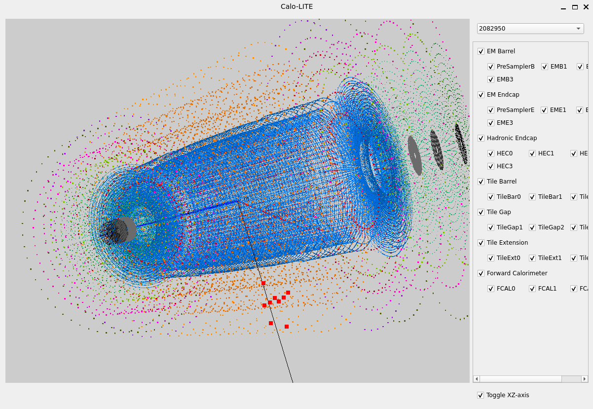

# CaloLITE
An 3D-interactive GUI that display all the cells in the calorimeter of the ATLAS detector at CERN. Intended to be used with ParticleGun samples ROOT files to display the clusters hit in the calorimeter (for fun or for debugging).



## Features:
* 3D interactive window -- Basic camera zoom (scroll), rotate (hold left-click and drag), translate (hold scroll and drag)
* Single Event Display -- Dropdown list with all event numbers in the ROOT file for selection
    * Gray line: (Approx.) trajectory of the truth particle (does not account for decay or magnetic bending)
    * Big Dots: Cells in calorimeter that was hit by the shower-cascade from the truth particle; different clusters are displayed in different colors
* Calorimeter Layers Display -- Physical location of the cells (small dots) for each calorimeter layer. Each layer/group of layers can be toggled on/off on display window.

## Installation
1. The following package is needed to run the program: 
```
pip install uproot PySide6 PyOpenGL
```
2. The demonstration datasets (including a file for $\pi^0$ and a file for $\pi^+$) can be found in this [link](https://cernbox.cern.ch/s/EmbSH7xjvuoFk0i). Download the datasets and move them to the `database` folder.

## Run
Run the following command:
```
python launch.py
```
(The default commnad would load the $\pi^0$ dataset. Additional options are shown here:)
```
options:
  -h, --help            show this help message and exit
  -ft {pi0,pi+}, --file_type {pi0,pi+}
                        Choose event file type (pi0, pi+)
  -et EVENT_TREE, --event_tree EVENT_TREE
                        TTree name in the event file
  -cb CELL_COORD_BRANCH, --cell_coord_branch CELL_COORD_BRANCH
                        TTree branch prefix of the cell coordinates in the event file
```

## Why in the world would you use this?
Idk, I just did this for fun.